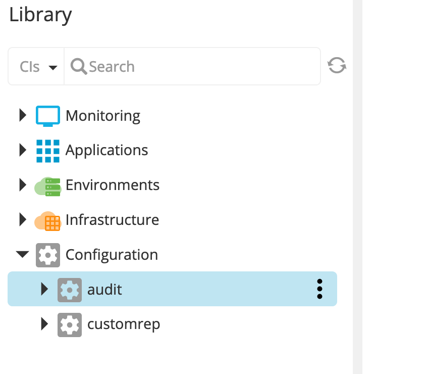
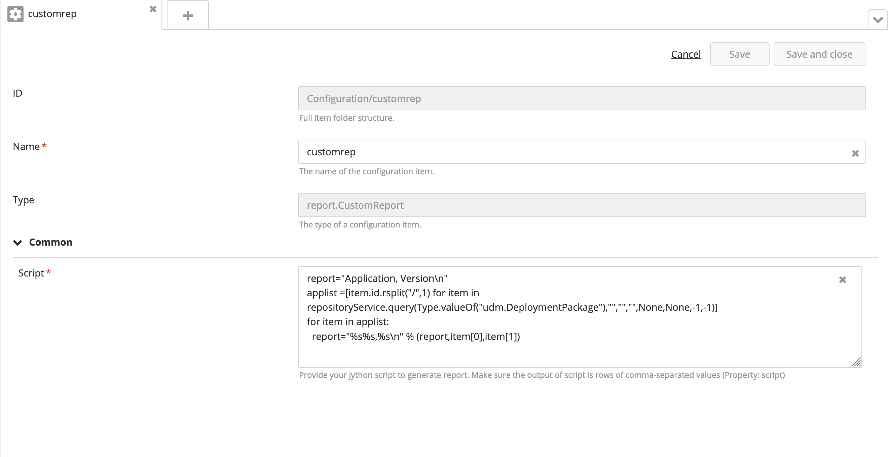
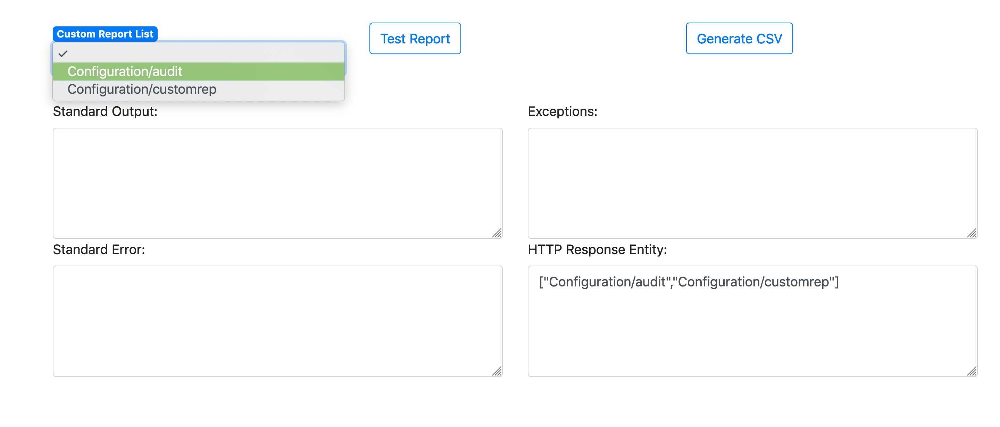
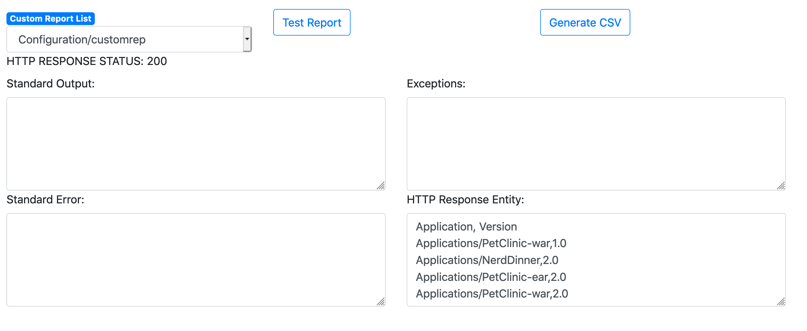
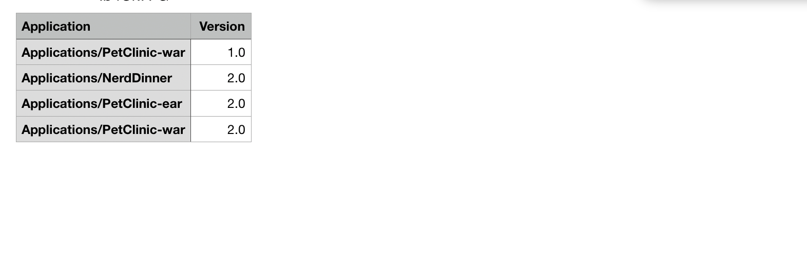
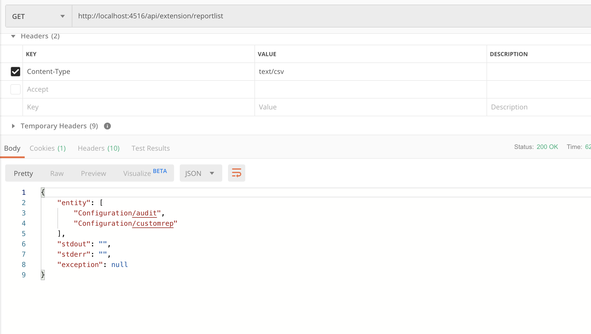
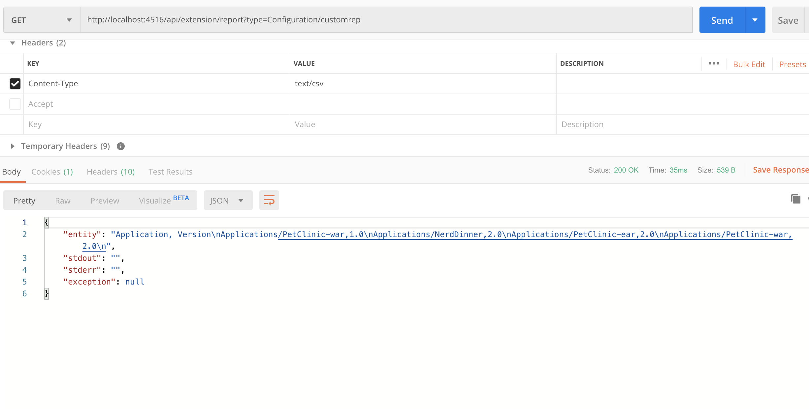

# XL Deploy Custom Report Plugin


## Preface
This document describes the functionality provided by the 'xld-custom-report-plugin'

## Overview
This plugin allows the user to generate all sorts of custom reports and extract them out using a custom REST Endpoint or through a Simple User Inteface. The goal of the plugin is to provide a framework so that users capable of writing jython/python scripting to pull data out of XL Release can provide a script and that is then utilized to pull a report. 

This also gives an opportunity to users to experience the power of XL Release extension framework that how easily it can be extended using   
-  Custom UI  
-  XML DSL   
-  Custom REST Endpoints  
-  Jython/Python  

**!! IMPORTANT !!**   

- This plugin is a pure community effort at this point and the script that you provide to pull out a report should be validated such that it doesn't slow down your system.  
- The UI csv download is generated using javascript so it might be limited by the size of data being pulled out by the report and hasn't been tested for the limits.

**!! Benefits !!** 
 
- It helps to pull data faster as all the scripting runs on server side and only one REST API call made to pull that data.  
- One can be creative in writing the script and generating any type of report
- The report from the UI can be downloaded as a CSV report that can be directly used in Excel
- The report from the custom REST Endpoint would be pulled out as json.  rows of comma separated values


## Installation
- Copy the plugin JAR fole into the *'SERVER_HOME/plugins'* directory of XL Deploy.

## Prerequisites 
Knowledge of Jython/Python scripting and XL Deploy jython API.  Please refer here for API [Jython API](https://docs.xebialabs.com/jython-docs/#!/xl-deploy/9.0.x/)

## Configuration
User can configure custom reports by writing their own scripts. A new configuration type **report.CustomReport** is introduced by the plugin that gives a text area to provide a custom jython script

**!! IMPORTANT !!**  

- Please do not have any print statements in your report script  
- The script should keep adding comma separated values in a variable called `report`
- Every row being appended should have a new line separator

#### Snapshot 1



#### Snapshot 2



## GUI Usage
Click on the top level custom menu **CustomReport** and you will see the following UI. The dropdown pulls the list of all reports configured under Configuration

#### Snapshot 3




Click on the **Test Report** to validate the execution and it also shows the output or errors

#### Snapshot 4



Click on the **Generate CSV** and the system would download a CSV file that contains that output. you can open it up in Excel and use it to your convenience.

#### Snapshot 5



## REST Endpoint Usage

Here's how you can also call the custom REST API to pull the data externally.

**REST API** : http://localhost:4516/api/extension/reportlist ( GET, basicauth )

Pulls the list of custom reports

#### Snapshot 6


**REST API** : http://localhost:4516/api/extension/report?type=< reportname > ( GET, basicauth )

Pulls the actual report

#### Snapshot 7



## Example

#### Simple dummy report
```
report = "1,2,3,4,5\n6,7,8,9,10\n"
```

#### Pull custom fields from a release
```
report="Application, Version\n"
applist =[item.id.rsplit("/",1) for item in repositoryService.query(Type.valueOf("udm.DeploymentPackage"),"","","",None,None,-1,-1)]
for item in applist:
  report="%s%s,%s\n" % (report,item[0],item[1])
```


